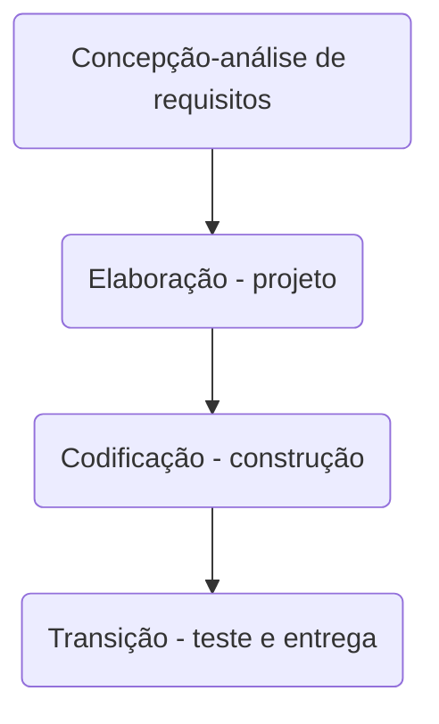

# Front-end_FullSports_typeScript
# Getting Started with Create React App

This project was bootstrapped with [Create React App](https://github.com/facebook/create-react-app).
## Description
[pnpm] `npm install -g pnpm`

[docker](https://docs.docker.com/get-docker/) install Docker.

[docker compose](https://docs.docker.com/compose/install/) install Docker Componse.
## Automatic installation with docker
```bash
# run local api
$ docker compose up or $ docker compose up --build
# DELETE THE CONTAINERS
$ docker compose down -v
```

## Running the app and Installation manual
## Node version
### `v16.20.0`


### `pnpm install `
installing the dependencies

### `pnpm dev`

Runs the app in the development mode.\
Open [http://localhost:3000](http://localhost:3000) to view it in the browser.

The page will reload if you make edits.\
You will also see any lint errors in the console.

### `pnpm test`

Launches the test runner in the interactive watch mode.\
See the section about [running tests](https://facebook.github.io/create-react-app/docs/running-tests) for more information.


## `pnpm lint:fix`
Code indentation as per design pattern

### `pnpm build`

Builds the app for production to the `build` folder.\
It correctly bundles React in production mode and optimizes the build for the best performance.

The build is minified and the filenames include the hashes.\
Your app is ready to be deployed!

See the section about [deployment](https://facebook.github.io/create-react-app/docs/deployment) for more information.

### `pnpm eject`

**Note: this is a one-way operation. Once you `eject`, you can’t go back!**

If you aren’t satisfied with the build tool and configuration choices, you can `eject` at any time. This command will remove the single build dependency from your project.

Instead, it will copy all the configuration files and the transitive dependencies (webpack, Babel, ESLint, etc) right into your project so you have full control over them. All of the commands except `eject` will still work, but they will point to the copied scripts so you can tweak them. At this point you’re on your own.

You don’t have to ever use `eject`. The curated feature set is suitable for small and middle deployments, and you shouldn’t feel obligated to use this feature. However we understand that this tool wouldn’t be useful if you couldn’t customize it when you are ready for it.

## Learn More

You can learn more in the [Create React App documentation](https://facebook.github.io/create-react-app/docs/getting-started).

To learn React, check out the [React documentation](https://reactjs.org/).


### Processo de Desenvolvimento de Software - PDS
| Grupo 04 |
| --- |
| Lisandra Ferraz de Santana |
| Gabriel Gozzi |
| Renan Figueiredo |
| Daniela Houck |
| Paulo H. C. Jesus |
> O PDS segue uma abordagem interativa incremental. Cada atividade da interação tem uma definição de pronto estabelecida com objetivo de controlar a qualidade. 

- 1-Concepção – visão aproximada, casos de uso de negócio, escopo e estimativas vagas (fase de estudo de viabilidade) 
- 2-Elaboração – visão refinada, a arquitetura central é iterativamente implementada e os problemas de alto risco são mitigados, identificação da maioria dos requisitos e do 
escopo e estimativas mais realistas. 
O projeto de software é iniciado logo que os requisitos de software tenham sido analisados e modelados e prepara a equipe para a transição entre a análise e o código. O 
projeto arquitetural define os relacionamentos entre os principais elementos estruturais do software (PRESSMAN, 6ed. p. 187). O projeto arquitetural pode ser apresentado 
na forma de múltiplas perspectivas. Krutchen (1995) sugere 4 visões: visão lógica, visão de implementação, visão de processo e visão de instalação. Adicionalmente as 4 
visões existe os cenários que determinam a dinâmica e o comportamento da aplicação. Cada cenário descreve como os vários componentes arquiteturais colaboram para 
manipular uma operação de sistema. 
- 3- Construção – mapeamento do projeto para o código, implementação iterativa dos elementos restantes de menor risco e preparação para implantação. 
- 4 - Transição – beta testes e implantação 
